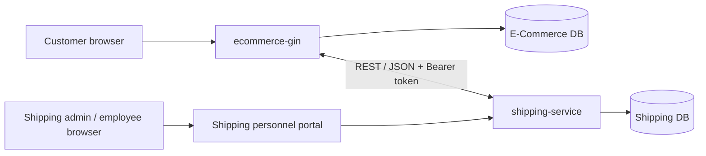
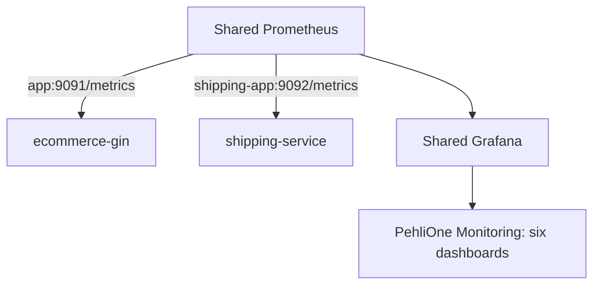

# NordShop Shipping & Returns Service

An independent Go/Gin logistics service for NordShop. It owns shipment tracking, delivery events, labels, QR codes, and operational logistics data. It does **not** read from or write to the e-commerce database.

## E-Commerce ↔ Shipping architecture



- `ecommerce-gin` remains the source of truth for orders, customers, payments, refunds, and return authorization rules.
- `shipping-service` owns shipment records, immutable sender/recipient snapshots, tracking numbers, delivery lifecycle state, timeline events, audit logs, and the ecommerce callback outbox.
- The integration is HTTP-only. No shared database tables, ORM models, or direct database imports are required or allowed.
- Shipment/return creation is idempotent via `Idempotency-Key`, shipping-side business keys, and database uniqueness constraints.
- Versioned migrations are applied through `schema_migrations`; runtime code no longer relies on `AutoMigrate`.

## Authentication

Two deliberately independent authentication boundaries are used:

- Human personnel use email/password at `/login` and an opaque, database-backed `HttpOnly`, `SameSite=Lax` session cookie. Production cookies are `Secure`. All portal mutations require a session-bound CSRF token.
- Service-to-service `/api/v1/*` calls continue to use `Authorization: Bearer <token>` and never accept the browser session as a substitute.

Portal roles are `admin` and `employee`. Admin routes under `/admin/*` are enforced server-side. Disabling an account, changing its role, or changing its password invalidates its existing sessions.

Employees can use the dashboard, shipment/return lists and details, authenticated QR scanner, lifecycle transitions, remaining-stop updates, profile image, and password change. Administrators additionally get cross-operation dashboards, personnel creation/edit/activation/role management, shipment overview, audit search, and employee activity summaries.

The first administrator can be created at startup with `INITIAL_ADMIN_EMAIL` and `INITIAL_ADMIN_PASSWORD`; remove both values after the first successful deployment. The password is hashed with bcrypt and is never stored in source code.

### Internal API authentication and request headers

All `/api/v1/*` endpoints require `Authorization: Bearer <token>`.

### Inbound e-commerce → shipping

- `ECOMMERCE_TO_SHIPPING_TOKEN` is the active service token.
- `ECOMMERCE_TO_SHIPPING_PREVIOUS_TOKEN` is optional for rotation.
- `ECOMMERCE_SERVICE_TOKEN` is still accepted as a backward-compatible fallback env var.

### Outbound shipping → e-commerce callbacks

- `ECOMMERCE_CALLBACK_URL` is the protected e-commerce callback endpoint.
- `SHIPPING_TO_ECOMMERCE_TOKEN` is sent as `Authorization: Bearer ...` for outbox delivery (`ECOMMERCE_CALLBACK_TOKEN` remains a compatibility alias).

### Required headers

- `Idempotency-Key` for `POST /api/v1/shipments` and `POST /api/v1/returns`
- `X-Request-ID` propagated end-to-end; generated when absent
- `X-Service-Name` or `User-Agent` for source-service attribution
- `X-Shipping-Role` for privileged operational routes (`shipping_admin`, `warehouse_employee`, `delivery_employee`, `support`)

## Internal API contract

Success envelope:

```json
{
  "success": true,
  "data": {}
}
```

Error envelope:

```json
{
  "success": false,
  "error": {
    "code": "SHIPMENT_NOT_FOUND",
    "message": "Shipment not found",
    "request_id": "req_..."
  }
}
```

Focused endpoints:

| Method | Path | Notes |
| --- | --- | --- |
| `POST` | `/api/v1/shipments` | Accept an E-Commerce handover, enter `handed_over`, or idempotently replay it |
| `GET` | `/api/v1/shipments/:trackingNumber` | JSON tracking summary without recipient PII |
| `GET` | `/api/v1/shipments/order/:orderID` | E-commerce order → shipment lookup |
| `GET` | `/api/v1/shipments/:trackingNumber/events` | Tracking timeline/events |
| `PATCH` | `/api/v1/shipments/:id/status` | Role-guarded lifecycle transition using public shipment id |
| `PATCH` | `/api/v1/shipments/:id/eta` | Role-guarded ETA update |
| `PATCH` | `/api/v1/shipments/:id/stops` | Role-guarded remaining stops update |
| `POST` | `/api/v1/shipments/:id/events` | Role-guarded timeline event append |
| `POST` | `/api/v1/returns` | Create or idempotently replay a physical return shipment |
| `GET` | `/api/v1/returns/:trackingNumber` | JSON return tracking summary |

The OpenAPI description lives in `docs/openapi.yaml`.

## Shipment lifecycle

Outbound shipments:

`created → label_created → ready_for_pickup → handed_over → received_at_origin → sorting → in_transit → arrived_at_destination_hub → out_for_delivery → delivered`

Return shipments:

`return_requested → return_authorized → return_label_created → return_in_transit → return_received → return_completed`

Each accepted status/ETA/stops/event mutation writes:

1. a shipment event
2. an audit log row
3. an outbox row for callback delivery

## Public features preserved

- `GET /track/:trackingNumber` keeps the HTML tracking page.
- `GET /qr/:trackingNumber` keeps the public QR image.
- `GET /shipments/:id/label` keeps the operational HTML label.
- Public tracking strips sender/recipient address details before rendering.

## Environment variables

| Variable | Purpose |
| --- | --- |
| `DATABASE_DSN_DOCKER` | Optional Docker-specific DSN; highest precedence |
| `DATABASE_DSN` | Optional general DSN; used when the Docker-specific DSN is empty |
| `MYSQL_HOST` / `MYSQL_PORT` | Host and port used when config builds the DSN |
| `SHIPPING_DB_HOST_PORT` | Host-published MySQL port and local fallback when `MYSQL_PORT` is empty |
| `MYSQL_DATABASE` / `MYSQL_USER` / `MYSQL_PASSWORD` | Required values when neither explicit DSN is set |
| `APP_ENV` | Runtime environment (`development`, `test`, or `production`) |
| `APP_URL` | Canonical public tracking/QR origin; required and HTTPS-only in production |
| `METRICS_PORT` | Private Prometheus listener (default `9092`; not published by Compose) |
| `GIN_MODE` | Gin mode; must be `release` in production |
| `TRUSTED_PROXIES` | Comma-separated proxy IPs/CIDRs |
| `SHIPPING_HOST_PORT` | Docker host port for Shipping (default `8090`) |
| `DATABASE_CONNECT_TIMEOUT` | Bounded startup retry window for the Shipping database |
| `ECOMMERCE_TO_SHIPPING_TOKEN` | Current inbound internal API token |
| `ECOMMERCE_TO_SHIPPING_PREVIOUS_TOKEN` | Optional previous inbound token during rotation |
| `ECOMMERCE_CALLBACK_URL` | E-commerce callback endpoint for shipping events |
| `ECOMMERCE_API_URL` | Internal E-Commerce origin; derives the callback path when an exact callback URL is omitted |
| `ECOMMERCE_PUBLIC_URL` | Browser-reachable E-Commerce origin |
| `SHIPPING_TO_ECOMMERCE_TOKEN` | Outbound callback bearer token |
| `INTERNAL_QR_SECRET` | Reserved secret for future signed internal QR flows |
| `SESSION_SECRET` | At least 32 characters; derives session-bound CSRF tokens |
| `SESSION_TTL` | Personnel session lifetime (default `12h`) |
| `PROFILE_IMAGE_DIRECTORY` | Persistent sanitized profile-image storage |
| `INITIAL_ADMIN_*` | Optional first-start administrator bootstrap; remove after use |
| `PUBLIC_BASE_URL` | Deprecated compatibility alias for `APP_URL` |
| `OUTBOX_POLL_INTERVAL` | Dispatcher poll interval |
| `OUTBOX_RETRY_BASE_DELAY` | Base retry backoff |
| `OUTBOX_PROCESSING_STALE_AFTER` | Recover stuck processing outbox rows after this age |
| `OUTBOX_MAX_ATTEMPTS` | Max callback delivery attempts before permanent failure |
| `WAREHOUSE_*` | Sender/depot address snapshot configuration |

## Docker / local development

Database DSN resolution is deterministic:

1. `DATABASE_DSN_DOCKER`
2. `DATABASE_DSN`
3. a DSN built from `MYSQL_USER`, `MYSQL_PASSWORD`, `MYSQL_DATABASE`, `MYSQL_HOST`, and `MYSQL_PORT` (or `SHIPPING_DB_HOST_PORT`)

Compose deliberately gives `shipping-app` the internal address `shipping-db:3306`. `SHIPPING_DB_HOST_PORT` only publishes MySQL to the host, for example as `127.0.0.1:3308`.

MySQL initialization variables only take effect when the data volume is first created. If an existing development volume was initialized under another database/user name, migrate it or explicitly recreate that volume after backing up any data you need; Compose does not delete it automatically.

```bash
cp .env.example .env
docker network inspect pehlione-backend >/dev/null 2>&1 || docker network create pehlione-backend
docker compose config
docker compose up --build
```

- Host access: `http://localhost:8090`

## Monitoring & Observability

Shipping participates in the existing E-Commerce Prometheus/Grafana stack; this repository intentionally does not start a second monitoring stack.



Shipping exposes Prometheus metrics on the private `METRICS_PORT` listener. Compose uses `expose`, not a host `ports` mapping, so `/metrics` is reachable by Prometheus over `pehlione-backend` but is not served on the public application port. The public operational probes remain:

- `GET /health/live` (`/health` and `/healthz` aliases): process liveness only; it does not restart the service because E-Commerce is temporarily unavailable.
- `GET /health/ready` (`/ready` and `/readyz` aliases): checks the Shipping MySQL dependency.

Key metric families include:

- `shipping_http_*`: request count, status, duration and in-flight requests, labeled with Gin route templates rather than raw IDs.
- `shipping_shipments_current`, `shipping_shipment_status_transitions_total`, `shipping_shipment_operations_total` and delivery-duration/failure metrics.
- `shipping_shipments_delivered_today`, an aggregate UTC-day delivery gauge for the shared overview.
- `shipping_returns_current`, `shipping_returns_created_total` and return transition metrics.
- `shipping_ecommerce_callback_*`, `shipping_ecommerce_dependency_up`, `shipping_outbox_current`, `shipping_outbox_retry_total` and `shipping_outbox_oldest_pending_seconds`.
- `shipping_api_auth_failures_total`, aggregate employee login results and aggregate QR scan results.
- standard Go runtime/process metrics and `go_sql_*{db_name="shipping"}` connection-pool metrics.

The shared configuration and provisioned assets live in the E-Commerce repository:

- Prometheus scrape configuration: `monitoring/prometheus.yml`
- alert rules: `monitoring/rules/shipping-alerts.yml`
- six dashboards in `monitoring/grafana/dashboards/`, provisioned into `PehliOne Monitoring`
- the `PehliOne Operations` playlist, provisioned with a 15-second rotation by the E-Commerce Compose stack

The dashboards use a five-second refresh and a last-15-minutes default window. They cover system overview, E-Commerce, Shipping, integration, infrastructure, and security/authentication. Start kiosk playback from **Dashboards → Playlists → PehliOne Operations** in Grafana at `http://localhost:3000`, then add `?kiosk` to the playback URL. Alert rules cover Shipping availability/readiness, HTTP errors and latency, callback dependency, outbox backlog/stalls/permanent failures, delivery failures, and service authentication spikes.

Metrics contain aggregate controlled labels only. Tokens, cookies, request/event IDs, customer/order/shipment identifiers, tracking numbers, addresses, email addresses and employee IDs are not labels. Personnel-specific accountability remains in audit logs. In production, keep Prometheus and Grafana on an internal network, VPN or protected administrative endpoint; only the Shipping application belongs behind the public `https://pehlione-shipping.com` origin.
- Container-to-container access: use Docker DNS such as `http://shipping-app:8090`
- The separate development stacks share only the external `pehlione-backend` network.
- Callback URLs target `http://ecommerce-app:8080`; they never use `localhost` inside a container.

## URL reference

Shipping runs on port `8090`; the main E-Commerce application runs on port `8080`.

### Local browser URLs

| Page | URL | Access |
| --- | --- | --- |
| Shipping home | <http://localhost:8090/> | Public |
| Personnel login | <http://localhost:8090/login> | Public |
| Employee dashboard | <http://localhost:8090/dashboard> | Employee or admin session |
| Shipments | <http://localhost:8090/shipments> | Employee or admin session |
| Returns | <http://localhost:8090/returns> | Employee or admin session |
| QR scanner | <http://localhost:8090/scan> | Employee or admin session |
| Profile | <http://localhost:8090/profile> | Employee or admin session |
| Admin dashboard | <http://localhost:8090/admin/dashboard> | Admin session |
| Admin shipments | <http://localhost:8090/admin/shipments> | Admin session |
| User management | <http://localhost:8090/admin/users> | Admin session |
| New user | <http://localhost:8090/admin/users/new> | Admin session |
| Audit log | <http://localhost:8090/admin/audit> | Admin session |
| Health check | <http://localhost:8090/health> | Public |
| Readiness check | <http://localhost:8090/ready> | Public |
| Main E-Commerce application | <http://localhost:8080/> | Separate application |

Resource URLs contain a real identifier:

- Public tracking: `http://localhost:8090/track/{trackingNumber}`
- Public tracking QR: `http://localhost:8090/qr/{trackingNumber}`
- Shipment detail: `http://localhost:8090/shipments/{shipmentID}`
- Shipment label: `http://localhost:8090/shipments/{shipmentID}/label`
- Return detail: `http://localhost:8090/returns/{returnID}`
- Admin user detail: `http://localhost:8090/admin/users/{userID}`

### Internal API URLs

The local host API base URL is `http://localhost:8090/api/v1`. Calls require the service bearer token; write operations also require the documented idempotency and role headers.

- Create shipment: `POST http://localhost:8090/api/v1/shipments`
- Shipment by tracking number: `GET http://localhost:8090/api/v1/shipments/{trackingNumber}`
- Shipment events: `GET http://localhost:8090/api/v1/shipments/{trackingNumber}/events`
- Shipment by E-Commerce order: `GET http://localhost:8090/api/v1/shipments/order/{orderID}`
- Create return: `POST http://localhost:8090/api/v1/returns`
- Return by tracking number: `GET http://localhost:8090/api/v1/returns/{trackingNumber}`

When both applications run in Docker, E-Commerce must call `http://shipping-app:8090`; Shipping must call E-Commerce at `http://ecommerce-app:8080`. These Docker DNS names are not browser URLs.

### Production URLs

- Shipping portal and public tracking: <https://pehlione-shipping.com>
- Personnel login: <https://pehlione-shipping.com/login>
- Admin dashboard: <https://pehlione-shipping.com/admin/dashboard>
- Main E-Commerce application: <https://pehlione-ecommerce.com>

Production API paths use `https://pehlione-shipping.com/api/v1/...`. Keep the internal API protected by service authentication; it is not a public browser API.

## Production deployment

The sibling `ecommerce-gin/docker-compose.production.yml` is the authoritative two-service production stack. It builds this repository, publishes Shipping at `https://pehlione-shipping.com` through Caddy, and does not expose port 8090 or the Shipping database on the host.

Production values are split by purpose:

- `APP_URL=https://pehlione-shipping.com` generates tracking links and QR contents.
- `ECOMMERCE_PUBLIC_URL=https://pehlione-ecommerce.com` identifies the browser-facing store.
- `ECOMMERCE_API_URL=http://ecommerce-app:8080` is private Docker traffic and derives the versioned callback endpoint.

Use the sibling `ecommerce-gin/scripts/New-ProductionEnv.ps1` generator to create ignored `.env.production` files for both repositories with matching, cryptographically secure service tokens. The combined stack reads its secrets from `ecommerce-gin/.env.production`; replace its remaining `CHANGE_ME` ACME/SMTP values before deployment. DNS for both domains must point to the deployment host before Caddy can obtain certificates. See the E-Commerce README for deployment and `curl` verification commands.

## Verification commands

```bash
test -z "$(gofmt -l .)"
go vet ./...
go test ./...
go test -race ./...
go build ./...
docker compose config
```

The sibling E-Commerce integration stack is started from `ecommerce-gin` with:

```bash
docker compose -f docker-compose.yml -f docker-compose.integration.yml up --build -d
```

## Known limitations

- Live SMTP/payment-provider behavior belongs to E-Commerce and requires external credentials or sandbox accounts.
- Public production TLS requires DNS A/AAAA records for both domains and inbound ports 80/443 to the Caddy host.
