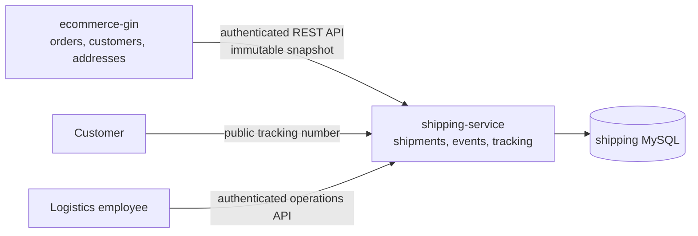

# NordShop Shipping & Returns Service

An independent Go/Gin logistics service for NordShop. It owns shipment tracking, delivery events, labels, QR codes, and operational logistics data. It does **not** read from or write to the e-commerce database.



## Architecture and data ownership

- `ecommerce-gin` remains the source of truth for customers, orders, products, payments, refunds, and customer addresses.
- This service owns shipments, immutable sender/recipient address snapshots, shipment item summaries, lifecycle events, audit records, and delivery outbox records.
- Shipment creation is idempotent through `Idempotency-Key`, unique external order IDs, and database constraints. Shipping does not share a database or modify e-commerce tables.
- Its versioned migration runner creates and records the logistics schema in the independent shipping database; `migrations/000001_initial.sql` documents the database boundary.

## API

All `/api/v1/*` endpoints require `Authorization: Bearer <ECOMMERCE_SERVICE_TOKEN>`.

| Endpoint | Purpose |
| --- | --- |
| `POST /api/v1/shipments` | Create/idempotently retrieve a shipment from an e-commerce snapshot |
| `POST /api/v1/returns` | Create/idempotently retrieve an authorized physical return shipment |
| `GET /api/v1/shipments/order/:orderID` | Get a shipment associated with an external order |
| `PATCH /api/v1/shipments/:id/status` | Apply a guarded status transition |
| `PATCH /api/v1/shipments/:id/stops` | Update remaining stops while out for delivery |
| `GET /track/:trackingNumber` | Public, PII-minimized tracking timeline |
| `GET /qr/:trackingNumber` | Public tracking QR image |
| `GET /health`, `GET /ready` | Process and database readiness probes |

Operational requests also require `X-Shipping-Role` (`shipping_admin`, `warehouse_employee`, `delivery_employee`, or `support`). A role is permitted only for its operational transitions. The first version uses trusted service credentials and role headers between internal trusted clients; replace this adapter with OIDC or mTLS at the deployment boundary.

## Shipment lifecycle

`created → label_created → ready_for_pickup → handed_over → received_at_origin → sorting → in_transit → arrived_at_destination_hub → out_for_delivery → delivered`

Delivery failure and return states are typed separately. Invalid or stale transitions are rejected by a transaction plus optimistic version check. Each accepted update writes a timeline event, audit record, and an outbox record for reliable callback delivery.

Returns use the same physical-shipment lifecycle with return-specific statuses (`return_requested` through `return_completed`) and are created through the authenticated return endpoint using selected item and customer-address snapshots. Refund decisions remain in e-commerce.

## Labels and QR

- `GET /shipments/:id/label` produces a printable HTML label for an authenticated logistics caller.
- The public QR contains only the public tracking URL; the public tracking page masks address data.
- Internal shipment pages display the immutable address snapshot only after service-token and shipping-role authorization.

## Local Docker setup

```bash
cp .env.example .env
docker compose config
docker compose up --build
```

The service runs at `http://localhost:8090` by default and uses its own `shipping-db` MySQL container. Required settings:

| Variable | Purpose |
| --- | --- |
| `DATABASE_DSN` | Shipping database DSN for host execution |
| `ECOMMERCE_SERVICE_TOKEN` | At least 32 random characters for internal API authentication |
| `INTERNAL_QR_SECRET` | Reserved at least 32-character secret for signed internal QR tokens |
| `PUBLIC_BASE_URL` | Public base URL encoded in tracking QR codes |
| `ECOMMERCE_CALLBACK_URL` | Future authenticated outbox callback target |
| `WAREHOUSE_*` | Sender/depot address snapshot configuration |

No real secrets are committed. Keep `.env` private.

## Security

The service applies service-to-service authentication, role checks, input validation, idempotency, transaction and optimistic-locking safeguards, generated opaque tracking identifiers, database uniqueness constraints, PII-minimized public tracking, and audit/outbox records. Do not log customer addresses, tracking numbers, or customer IDs as metrics labels.

## Tests and verification

```bash
gofmt -w .
go vet ./...
go test ./...
go test -race ./...
go build ./...
docker compose config
```
